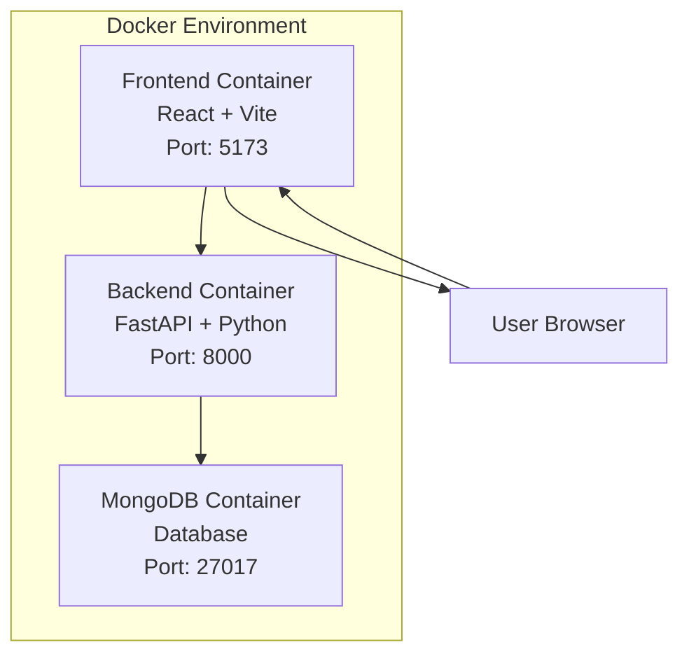

# LeanCon IFC Viewer

> A modern web application for visualizing and analyzing IFC (Industry Foundation Classes) building models with advanced 3D rendering capabilities.

[](https://www.docker.com/)
[](https://fastapi.tiangolo.com/)
[](https://reactjs.org/)
[](https://www.mongodb.com/)

## Table of Contents
- [Quick Start](#-quick-start)
- [Docker Architecture](#-docker-architecture)
- [Application Architecture](#-application-architecture)
- [Development Setup](#-development-setup)
- [Manual Installation](#-manual-installation)
- [Project Structure](#-project-structure)
- [Features](#-features)
- [Technology Stack](#-technology-stack)
- [Troubleshooting](#-troubleshooting)

## Quick Start

### Prerequisites
- [Docker Desktop](https://www.docker.com/products/docker-desktop/) installed and running
- Git installed

### One-Command Setup
```bash
# Clone the repository
git clone <your-repository-url>
cd LeanCon-assignment

# Build and start all services
docker-compose up --build
```

### Access Points
- Frontend: [http://localhost:5173](http://localhost:5173)
- Backend API: [http://localhost:8000](http://localhost:8000)
- API Documentation: [http://localhost:8000/docs](http://localhost:8000/docs)

---

## Docker Architecture

Our application uses a **3-tier containerized architecture** orchestrated by Docker Compose:



### Service Configuration

| Service | Technology | Port | Purpose |
|---------|------------|------|----------|
| **Frontend** | React 19 + Vite | 5173 | 3D IFC model visualization |
| **Backend** | FastAPI + Python 3.11 | 8000 | IFC processing & REST API |
| **Database** | MongoDB | 27017 | IFC data storage |

### Volume Mounts (Development)
- **Hot Reloading**: Code changes reflect instantly without rebuilding
- **Persistent Data**: MongoDB data survives container restarts
- **Node Modules**: Optimized dependency management

---

## Application Architecture

### Backend Architecture (FastAPI)
```
Backend Container
├── FastAPI Application (ASGI)
├── IFC Processing (IfcOpenShell)
├── MongoDB Integration (PyMongo)
├── Static File Serving (/ifc endpoint)
├── CORS Middleware
└── Automatic OpenAPI Documentation
```

**Key Components:**
- **FastAPI**: High-performance async Python framework
- **IfcOpenShell**: Industry-standard IFC file processing
- **MongoDB**: Document database for hierarchical IFC data
- **Uvicorn**: Production-ready ASGI server

### Frontend Architecture (React + 3D)
```
Frontend Container
├── React 19 (Concurrent Features)
├── ThatOpen Components (BIM Viewer)
├── Three.js (3D Rendering Engine)
├── Tailwind CSS (Utility-First Styling)
├── React Router (SPA Navigation)
└── Vite (Lightning-Fast Build Tool)
```

**Key Components:**
- **ThatOpen Components**: Specialized BIM/IFC 3D viewer
- **Three.js**: WebGL-based 3D rendering
- **React 19**: Latest React with improved performance
- **Vite**: Fast development with HMR

---

## Development Setup

### Development Workflow
```bash
# Start services in background
docker-compose up -d

# View logs for specific service
docker-compose logs -f backend   # Backend logs
docker-compose logs -f frontend  # Frontend logs
docker-compose logs -f mongo     # Database logs

# Rebuild after major changes
docker-compose up --build

# Stop all services
docker-compose down

# Complete cleanup (removes volumes/images)
docker-compose down --rmi all --volumes
```

### Environment Variables

#### Backend Environment
```yaml
PYTHONPATH: /app                    # Python module resolution
MONGO_URI: mongodb://mongo:27017    # Database connection
```

#### Frontend Environment
```yaml
VITE_API_URL: http://localhost:8000  # API endpoint
NODE_ENV: development                # Development mode
```

---

## Manual Installation

<details>
<summary>Click to expand manual setup instructions</summary>

### Backend Setup

1. **Navigate to backend directory**
   ```bash
   cd backend
   ```

2. **Create virtual environment**
   ```bash
   # Windows
   python -m venv venv
   venv\Scripts\activate
   
   # macOS/Linux
   python3 -m venv venv
   source venv/bin/activate
   ```

3. **Install dependencies**
   ```bash
   pip install -r requirements.txt
   ```

4. **Start MongoDB** (separate installation required)
   ```bash
   # Install MongoDB Community Edition
   # Start MongoDB service
   ```

5. **Run FastAPI server**
   ```bash
   uvicorn app.main:app --reload --host 0.0.0.0 --port 8000
   ```

### Frontend Setup

1. **Navigate to frontend directory**
   ```bash
   cd frontend
   ```

2. **Install Node.js dependencies**
   ```bash
   npm install
   ```

3. **Start development server**
   ```bash
   npm run dev
   ```

</details>

---

## Project Structure

```
LeanCon-assignment/
├── docker-compose.yml          # Docker orchestration
├── README.md                   # This file
│
├── backend/                    # FastAPI Backend
│   ├── Dockerfile             # Backend container config
│   ├── requirements.txt       # Python dependencies
│   ├── app/                   # Application code
│   │   ├── main.py            # FastAPI entry point
│   │   ├── api/               # API routes
│   │   ├── core/              # Configuration
│   │   └── services/          # Business logic
│   └── ifc/                   # IFC model files
│
└── frontend/                   # React Frontend
    ├── Dockerfile             # Frontend container config
    ├── package.json           # Node.js dependencies
    ├── public/                # Static assets
    └── src/                   # Source code
        ├── App.jsx            # Main application
        ├── components/        # React components
        ├── pages/             # Application pages
        ├── services/          # API services
        └── styles/            # CSS styles
```

---

## Features

### Core BIM Features
- **IFC Model Upload** - Support for standard IFC file formats
- **Interactive 3D Viewer** - Smooth navigation and manipulation
- **Element Highlighting** - Click table rows to highlight 3D elements
- **Floor Level Filtering** - View specific building levels
- **Quantity Analysis** - Volume and length measurements per element
- **Multi-Model Support** - Switch between multiple IFC models

### Advanced Features
- **Smart Camera Positioning** - Automatic optimal viewpoint calculation
- **Fragment Management** - Efficient rendering of large IFC models
- **Loading States** - Progress indicators during model processing
- **Error Handling** - Robust initialization and state management
- **Hot Reloading** - Instant development feedback

---

## Technology Stack

### Backend Technologies
| Technology | Version | Purpose |
|------------|---------|----------|
| **Python** | 3.11 | Runtime environment |
| **FastAPI** | 0.116.1 | Web framework |
| **IfcOpenShell** | 0.8.3 | IFC file processing |
| **MongoDB** | Latest | Document database |
| **PyMongo** | 4.13.2 | MongoDB driver |
| **Uvicorn** | 0.35.0 | ASGI server |

### Frontend Technologies
| Technology | Version | Purpose |
|------------|---------|----------|
| **React** | 19.1.0 | UI framework |
| **Vite** | 7.0.4 | Build tool |
| **ThatOpen Components** | 3.1.0 | BIM viewer |
| **Three.js** | 0.178.0 | 3D rendering |
| **Tailwind CSS** | 4.1.11 | Styling |
| **React Router** | 7.7.0 | Navigation |

### Infrastructure
| Technology | Purpose |
|------------|----------|
| **Docker** | Containerization |
| **Docker Compose** | Service orchestration |
| **MongoDB** | Data persistence |
| **CORS** | Cross-origin requests |

---

## Troubleshooting

### Common Issues

#### Docker Issues
```bash
# Ensure Docker Desktop is running
# Check Docker status
docker --version
docker-compose --version

# Force complete rebuild
docker-compose down --rmi all --volumes
docker-compose up --build

# Check service logs
docker-compose logs [service-name]
```

#### Port Conflicts
```bash
# Check if ports are in use
netstat -an | findstr :5173  # Windows
lsof -i :5173               # macOS/Linux

# Kill processes using ports
# Windows: Use Task Manager
# macOS/Linux: kill -9 $(lsof -t -i:5173)
```

#### Cache Issues
```bash
# Clear Docker build cache
docker system prune -a

# Clear npm cache (if running manually)
npm cache clean --force
```

### Getting Help

1. **Check the logs**: `docker-compose logs`
2. **Verify all services are running**: `docker-compose ps`
3. **Test API connectivity**: Visit `http://localhost:8000/docs`
4. **Check frontend build**: Visit `http://localhost:5173`

---

## Contributing

This project uses a modern development stack with Docker for consistency across environments. The architecture supports:

- **Hot reloading** for fast development
- **Easy testing** with isolated services
- **Horizontal scaling** capabilities
- **Production deployment** readiness

---

## License

This project is part of the LeanCon assignment and follows the specified requirements for IFC model visualization and analysis.

---

<div align="center">
  <strong>Built with ❤️ for the AEC industry</strong>
</div>
